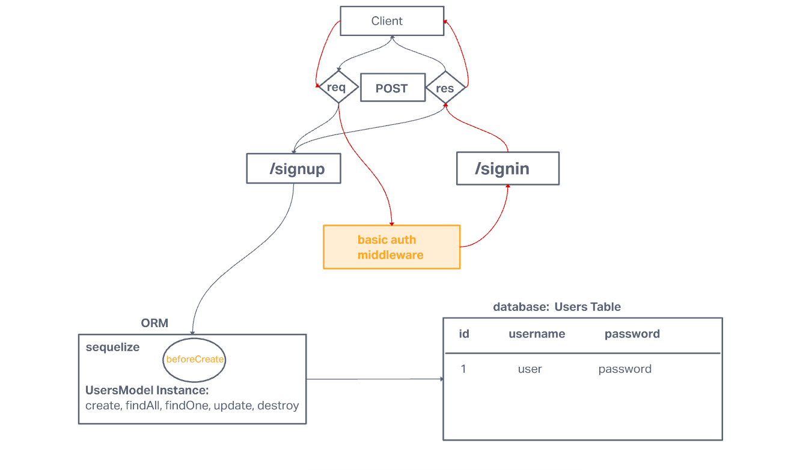

# LAB - Class 6

## Project: Basic Auth

### Author: Yen Xiong Yuan

### Problem Domain

#### As a user, I want to create a new account so that I may later login

* Using an HTTP REST client or a web form:   
      - Make a POST request to the/signup route with username and password.   
      - Your server should support both JSON and FORM data as input.   
      - On a successful account creation, return a 201 status with the user object in the body.   
      - On any error, trigger your error handler with an appropriate error.

#### As a user, I want to login to my account so that I may access protected information

* Using an HTTP REST client or a web form:   
      - Make a POST request to the /signin route.   
      - Send a basic authentication header with a properly encoded username and password combination.   
      - On a successful account login, return a 200 status with the user object in the body.   
      - On any error, trigger your error handler with the message “Invalid Login”.

### Links and Resources

- [GitHub Actions ci/cd](https://github.com/yenxiongyuan/basic-auth/actions)

### Setup

#### `.env` requirements (where applicable)

for now I have none and do not require one

#### How to initialize/run your application (where applicable)

- e.g. `npm start`

#### How to use your library (where applicable)

#### Features / Routes

- Feature One: Details of feature
- GET : `/hello` - specific route to hit

#### Tests

- How do you run tests?
- Any tests of note?
- Describe any tests that you did not complete, skipped, etc

#### UML

